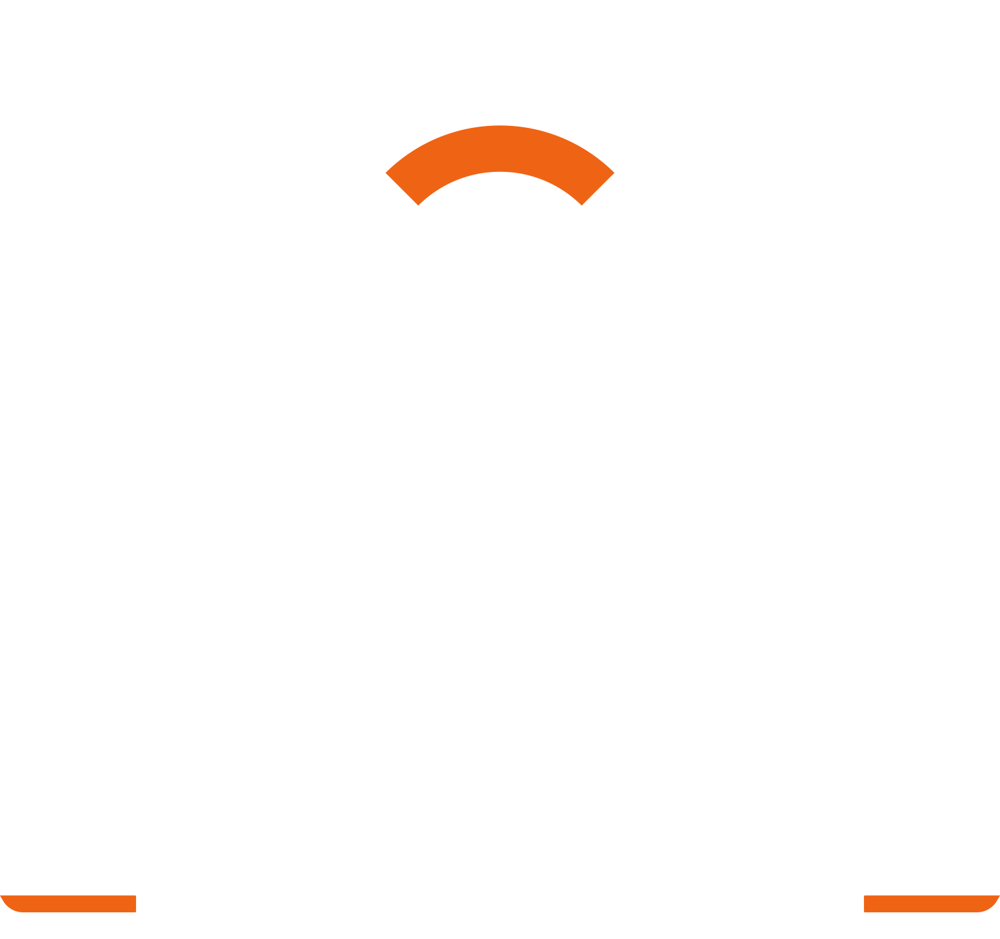

# owcs-thingy
scrapes owcs data from OWTV.gg

TODO:

- add flags to !tournament command
- add reading /news, /matches pages and respective commands
- make embedded tournament message prettier
    - icons
    - timestamp
    - merge name and link to look cleaner
    - add emojis of owcs logos

<!--  -->